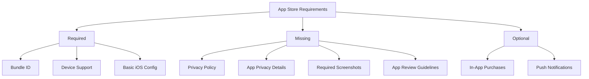

# App Store Publication Checklist

## Current Status Analysis



## Required Changes for App Store Submission

### 1. App Configuration Updates

Current in app.json:
```json
"ios": {
  "supportsTablet": true,
  "bundleIdentifier": "com.francaisfutur.apprendre",
  "infoPlist": {
    "UIRequiredDeviceCapabilities": [
      "arm64"
    ]
  }
}
```

Needed additions:
```json
"ios": {
  "buildNumber": "1",
  "requireFullScreen": true,
  "infoPlist": {
    "CFBundleDevelopmentRegion": "fr_FR",
    "LSApplicationQueriesSchemes": [],
    "UIBackgroundModes": [],
    "NSPhotoLibraryUsageDescription": "",
    "NSCameraUsageDescription": "",
    "NSMicrophoneUsageDescription": "",
    "ITSAppUsesNonExemptEncryption": false
  }
}
```

### 2. Required Documentation

1. Privacy Policy
   - Must be added for app submission
   - Should cover data collection, usage, and storage
   - Must be accessible via URL

2. App Privacy Details
   - Data collection and usage declarations
   - Third-party integrations
   - Data tracking information

### 3. App Store Metadata

Required assets:
- App icon (1024x1024px)
- Screenshots for:
  - iPhone (6.5" display)
  - iPhone (5.5" display)
  - iPad (12.9" display) if tablet support is enabled
- App description (FR/EN)
- Keywords for search optimization
- Support URL
- Marketing URL (optional)

### 4. Content Requirements

1. Content Ratings:
   - Age rating declaration
   - Content rights verification
   - Educational content verification

2. App Review Guidelines Compliance:
   - No placeholder content
   - Complete functionality
   - Proper error handling
   - No beta/demo/test labels

### 5. Technical Requirements

1. Performance:
   - Launch time optimization
   - Memory usage optimization
   - Crash reporting implementation

2. Device Support:
   - iOS 13.0 or later recommended
   - iPad support verification
   - Device orientation handling

3. Data Handling:
   - Proper data persistence
   - Cache management
   - Offline functionality

## Action Plan

1. Immediate Actions:
   - Create privacy policy document
   - Prepare app privacy details
   - Update app.json configuration

2. Asset Preparation:
   - Create required screenshots
   - Optimize app icon
   - Prepare marketing materials

3. Technical Optimization:
   - Implement crash reporting
   - Add analytics (optional)
   - Test on multiple iOS devices

4. Documentation:
   - Complete App Store description
   - Prepare support documentation
   - Create help/FAQ section

5. Testing:
   - Full UI/UX review
   - Performance testing
   - Content verification

## Timeline Estimate

1. Configuration Updates: 1-2 days
2. Asset Preparation: 2-3 days
3. Documentation: 2-3 days
4. Testing & Optimization: 3-5 days
5. Submission Process: 1-2 days

Total estimated time: 9-15 days

## Common Rejection Reasons to Avoid

1. Incomplete Information
   - Missing privacy policy
   - Incomplete app metadata
   - Placeholder content

2. Functionality Issues
   - Crashes and bugs
   - Broken links
   - Poor performance

3. Content Concerns
   - Copyright issues
   - Inappropriate content
   - Misleading descriptions

4. Design Problems
   - Poor user interface
   - Confusing navigation
   - Inconsistent experience

## Next Steps

1. Review this checklist and prioritize tasks
2. Begin with privacy policy creation
3. Update app.json with required configurations
4. Start preparing App Store assets
5. Implement missing technical requirements
6. Conduct thorough testing
7. Prepare for submission

Would you like to proceed with implementing any specific part of this plan?