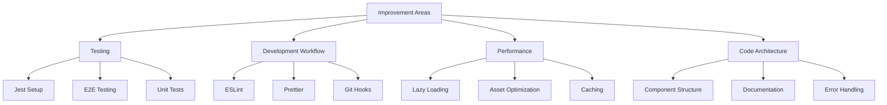

# Project Improvements Plan

## Overview

This document outlines the planned improvements for the App Citoyenneté project, focusing on enhancing code quality, testing, performance, and developer experience.



## 1. Testing Enhancements

### Jest Configuration
- Add Jest configuration for React Native
- Configure TypeScript support in Jest
- Set up test environment with proper mocks
- Add test scripts to package.json

```json
{
  "scripts": {
    "test": "jest",
    "test:watch": "jest --watch",
    "test:coverage": "jest --coverage"
  }
}
```

### E2E Testing with Detox
- Install and configure Detox
- Set up iOS and Android test configurations
- Create basic navigation tests
- Implement critical user flow tests

### Unit Tests
- Add tests for services layer
- Implement component unit tests
- Add snapshot testing
- Target 80% code coverage

## 2. Development Workflow

### ESLint Setup
- Configure ESLint with TypeScript support
- Add React and React Native specific rules
- Implement custom rules for project consistency

```json
{
  "extends": [
    "eslint:recommended",
    "plugin:@typescript-eslint/recommended",
    "plugin:react/recommended",
    "plugin:react-native/all"
  ]
}
```

### Prettier Integration
- Add Prettier configuration
- Configure ESLint + Prettier integration
- Add format scripts to package.json

### Git Hooks with Husky
- Add pre-commit hooks
- Add commit message validation
- Configure automatic formatting on commit

## 3. Performance Optimizations

### Lazy Loading Implementation
- Add dynamic imports for routes
- Implement code splitting
- Add loading states for async components

```typescript
const LessonScreen = React.lazy(() => import('./screens/Lessons/LessonScreen'));
```

### Asset Optimization
- Implement proper image optimization
- Add asset caching strategies
- Configure proper asset bundling

### Caching Strategies
- Implement proper data caching
- Add offline support
- Optimize API calls

## 4. Code Architecture

### Component Structure
- Reorganize components by feature
- Create shared components library
- Implement proper component composition

```
src/
├── features/
│   ├── lessons/
│   ├── quiz/
│   └── revision/
├── shared/
│   ├── components/
│   └── hooks/
└── core/
    ├── services/
    └── utils/
```

### Documentation
- Add JSDoc comments to all components
- Create component documentation with Storybook
- Add API documentation
- Update README with setup instructions

### Error Handling
- Implement proper error boundaries
- Add error reporting
- Improve error messages and logging

## Implementation Priority

1. Development Workflow
   - Easy wins with immediate developer experience improvements
   - Sets foundation for further improvements

2. Testing Infrastructure
   - Critical for ensuring stability during refactoring
   - Enables confident changes

3. Code Architecture
   - Structural improvements
   - Better organization and maintainability

4. Performance Optimizations
   - Measurable user experience improvements
   - Built on stable architecture

## Next Steps

1. Review and approve improvement plan
2. Set up initial development workflow improvements
3. Begin testing infrastructure implementation
4. Start gradual code architecture improvements
5. Measure and optimize performance

## Success Metrics

- Test coverage > 80%
- Lighthouse performance score > 90
- Build time < 2 minutes
- Zero linting errors
- Documented components > 90%