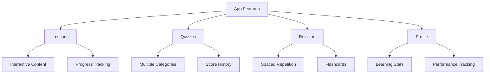

# App Naturalisation

A React Native application built with Expo to help users learn and prepare for French naturalization. The app provides lessons, quizzes, flashcards, and spaced repetition learning features to master the content required for French citizenship.

## Features



- **Interactive Lessons**: Comprehensive content covering French history, culture, and civic knowledge
- **Quiz System**: Test your knowledge with quizzes from various categories
- **Spaced Repetition**: Efficient learning using SRS (Spaced Repetition System)
- **Progress Tracking**: Monitor your learning journey and performance
- **Offline Support**: Access content without internet connection

## Technology Stack

- React Native
- Expo (version 52)
- TypeScript
- React Navigation
- React Native Paper
- AsyncStorage

## Project Structure

```
app_naturalisation/
├── assets/              # Images and static assets
├── components/          # Reusable UI components
├── constants/          # Theme and configuration
├── data/              # JSON content files
├── hooks/             # Custom React hooks
├── models/            # TypeScript type definitions
├── navigation/        # Navigation configuration
├── screens/           # App screens
└── services/          # Business logic and utilities
```

## Getting Started

### Prerequisites

- Node.js (recommended version: 18 or higher)
- npm or yarn
- Expo CLI
- iOS Simulator or Android Emulator (optional)

### Installation

1. Clone the repository
```bash
git clone [repository-url]
cd app_naturalisation
```

2. Install dependencies
```bash
npm install
```

3. Start the development server
```bash
npm start
# or for a clean start:
npm start -- -c
```

4. Run on specific platform
```bash
# For iOS
npm run ios

# For Android
npm run android

# For web
npm run web
```

## Development

### Available Scripts

- `npm start`: Start the Expo development server
- `npm run android`: Run on Android emulator/device
- `npm run ios`: Run on iOS simulator/device
- `npm run web`: Run in web browser
- `npm test`: Run tests

### Content Structure

The app uses JSON files in the `data/json/` directory for content management:
- History
- Geography
- Institutions
- Values of the Republic
- Rights and Duties
- And more...

## Testing

Currently implementing comprehensive testing strategy including:
- Unit tests with Jest
- Component testing
- E2E testing with Detox

## Contributing

1. Create a feature branch (`git checkout -b feature/amazing-feature`)
2. Commit your changes (`git commit -m 'Add amazing feature'`)
3. Push to the branch (`git push origin feature/amazing-feature`)
4. Open a Pull Request

## License

This project is proprietary software.

## Contact

Project Owner: [Your contact information]
