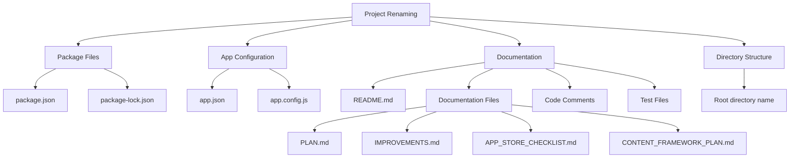

# Project Renaming Plan

## Changes Required



## 1. Package Files Update
- Update `package.json`:
  ```json
  {
    "name": "app-citoyennete",
    "version": "1.0.0",
    ...
  }
  ```
- Regenerate `package-lock.json` with new name

## 2. App Configuration
- Update `app.json`:
  ```json
  {
    "expo": {
      "name": "App Citoyenneté",
      "slug": "app-citoyennete",
      ...
    }
  }
  ```

## 3. Documentation Updates

### Core Documentation
- Update README.md
  - Project name and description
  - Installation instructions
  - Directory structure references
  - Remove Lovable-specific deployment sections

### Planning Documents
- Update PLAN.md
  - Project structure references
  - Directory paths
  - Any Lovable-specific content

### Technical Documentation
- Update APP_STORE_CHECKLIST.md
  - App name references
  - Bundle identifiers
  - Store listing details

### Content Framework
- Update CONTENT_FRAMEWORK_PLAN.md
  - Project references
  - Content structure
  - File paths

### Code Documentation
- Review and update JSDoc comments in:
  - Components (ContentErrorBoundary.tsx, etc.)
  - Services (contentManager.ts, etc.)
  - Navigation files
- Update test file references in:
  - `services/__tests__/contentSync.test.ts`
  - `services/__tests__/contentTestHelper.ts`

## 4. Bundle Identifiers
- Update iOS bundle identifier:
  ```json
  "ios": {
    "bundleIdentifier": "com.francaisfutur.citoyennete"
  }
  ```
- Update Android package name:
  ```json
  "android": {
    "package": "com.francaisfutur.citoyennete"
  }
  ```

## 5. Content and Services
- Update any hardcoded references in:
  - Navigation files
  - Service configurations
  - Test configurations
  - Content management files

## Implementation Steps

1. Create backup of current state
2. Update package.json and regenerate package-lock.json
3. Update app.json configuration
4. Update all documentation files
5. Update code documentation and comments
6. Update test files and configurations
7. Test that app still builds and runs correctly
8. Verify content loading and management
9. Test navigation and routing
10. Commit changes with clear rename message
11. Update any CI/CD configurations if present

## Testing Checklist

1. Development Build
   - Clean install of dependencies
   - Development server startup
   - Hot reload functionality

2. Content Management
   - Content loading
   - JSON parsing
   - File paths resolution

3. Navigation
   - Deep linking
   - Screen transitions
   - Route names

4. Unit Tests
   - Service tests
   - Component tests
   - Content management tests

## Potential Risks

1. Breaking existing development setups
2. Loss of development history
3. Build process interruption
4. Content loading issues
5. Navigation routing problems

## Mitigation Strategy

1. Document all changes
2. Test builds after each major change
3. Keep backup of original configurations
4. Update development team on changes
5. Verify content loading after rename
6. Test all navigation paths

## Success Criteria

1. All documentation updated and consistent
2. Build process working
3. All tests passing
4. Content loading correctly
5. Navigation working as expected
6. No references to old project name

Would you like to proceed with implementing these changes?